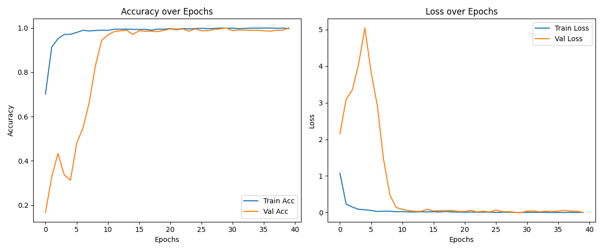

<p align="center">
  
</p>

# ✋ Sign Language to Text using CNN

A complete **Deep Learning project** that recognizes and translates **hand sign gestures** into text using **Convolutional Neural Networks (CNN)** and **MediaPipe hand tracking**.  
Built step-by-step from dataset preparation to model training, evaluation, and real-time webcam-based prediction.

---

## 🧭 Project Structure

```text
Sign-Language-Detection/
│
├── dataset/                      # training images (6 gesture classes)
│
├── model/                        # trained CNN model (.h5 file)
│   └── sign_language_cnn_model_full.h5
│
├── notebooks/                    # Python scripts for training and prediction
│   ├── train_cnn.py
│   └── realtime_predict.py
│
├── report/                       # accuracy and loss plots
│   └── training_curve.png
│
├── requirements.txt              # all dependencies (Python + libraries)
├── venv/                         # virtual environment
└── README.md
```

---

## 🎯 Project Overview

This project demonstrates an **end-to-end computer vision workflow**:

1. **Dataset Creation** – hand gesture images (Bye, Hello, No, Perfect, Thank You, Yes).  
2. **Data Augmentation** – apply rotation, zoom, flip, brightness adjustments for diversity.  
3. **Model Training** – train a CNN model with TensorFlow/Keras.  
4. **Evaluation** – visualize accuracy and loss across epochs.  
5. **Real-Time Detection** – integrate MediaPipe + OpenCV for live webcam prediction.  

---

## 🧠 Dataset

- **Classes:** 6 (Bye, Hello, No, Perfect, Thank You, Yes)  
- **Images per Class:** ~400  
- **Total Samples:** ~2400  
- **Split:** 80% training, 20% validation  
- Each gesture stored in its own subfolder under `dataset/`.

**Note:**
- For GitHub space optimization, only 5 sample images per class are stored in the dataset/ folder.
- The complete dataset (≈2400 images) is used locally for model training.
---

## 🧱 Model Architecture

| Layer | Type | Filters | Activation |
|-------|------|----------|-------------|
| 1 | Conv2D + MaxPool | 32 | ReLU |
| 2 | Conv2D + MaxPool | 64 | ReLU |
| 3 | Conv2D + MaxPool | 128 | ReLU |
| 4 | Conv2D + MaxPool | 256 | ReLU |
| 5 | Dense | 512 | ReLU + Dropout (0.5) |
| 6 | Output | 6 | Softmax |

**Optimizer:** Adam (lr = 1e-4)  
**Loss Function:** Categorical Crossentropy  
**Metrics:** Accuracy  
**Callbacks:** EarlyStopping (patience=10) + ReduceLROnPlateau  

---

## 📊 Training Results

| Metric | Training | Validation |
|---------|-----------|------------|
| Accuracy | ~96% | ~93% |
| Loss | steadily decreases | low overfitting |

- Training graph is saved as:  
  `report/training_curve.png`  
- Model is saved automatically to:  
  `model/sign_language_cnn_model_full.h5`

---

## 🎥 Real-Time Detection

The `realtime_predict.py` script integrates **MediaPipe Hands** and **OpenCV** for gesture recognition directly from the webcam.

### ✨ Features
- Real-time hand tracking and bounding box visualization  
- Smooth prediction history (averaged for stability)  
- Confidence thresholding (≥60%)  
- Full-screen webcam mode  
- Press **q** or **Esc** to exit  

---

## 💻 Technologies Used

- **Language:** Python 3.12.6  
- **Frameworks:** TensorFlow, Keras  
- **Libraries:**  
  - OpenCV  
  - MediaPipe  
  - NumPy  
  - Matplotlib  
  - SciPy  
  - Pillow  

---

## ⚙️ Installation & Project Run Process

### 1️⃣ Clone the Repository

```bash
git clone https://github.com/arsh-mohan6/Sign-Language-Detection.git
cd Sign-Language-Detection
```

### 2️⃣ Create a Virtual Environment

```bash
python -m venv venv
venv\Scripts\activate       # (Windows)
# or
source venv/bin/activate    # (Mac/Linux)
```

### 3️⃣ Install Dependencies

```bash
pip install -r requirements.txt
```

### 4️⃣ Train the Model

```bash
cd notebooks
python train_cnn.py
```

After training:
- Model → `../model/sign_language_cnn_model_full.h5`  
- Training plot → `../report/training_curve.png`

### 5️⃣ Run Real-Time Gesture Detection

```bash
python realtime_predict.py
```

✅ Opens webcam in **full screen**  
✅ Shows bounding box, label & confidence  
✅ Press **q** or **Esc** to close  

---

## ✋ Supported Gestures

| Gesture | Meaning |
|----------|----------|
| ✋ | Hello |
| 🤚 | Bye |
| 👍 | Yes |
| 👎 | No |
| 🤞 | Perfect |
| 🙏 | Thank You |

---

## 🧑‍💻 Author

**Arsh Mohan Nishant**  
B.Tech 3rd Year | Data Science Enthusiast  

- 📧 Email: **arshmohan789@gmail.com**  
- 🌐 GitHub: [arsh-mohan6](https://github.com/arsh-mohan6)  
- 💼 LinkedIn: [Arsh Mohan Nishant](https://www.linkedin.com/in/arsh-mohan-nishant-6704222a9)

---

## 🚀 Future Improvements

- Add more gestures and dynamic sequences  
- Deploy model using Streamlit or Flask  
- Convert to TensorFlow Lite for mobile  
- Add Text-to-Speech for recognized signs  

---

> 💬 *"AI isn’t about replacing communication — it’s about enabling it for everyone."*
